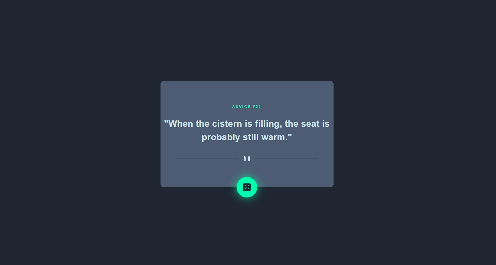

# Frontend Mentor - Advice generator app solution

This is a solution to the [Advice generator app challenge on Frontend Mentor](https://www.frontendmentor.io/challenges/advice-generator-app-QdUG-13db). Frontend Mentor challenges help you improve your coding skills by building realistic projects.

## Table of contents

- [Overview](#overview)
  - [The challenge](#the-challenge)
  - [Screenshot](#screenshot)
  - [Links](#links)
- [My process](#my-process)
  - [Built with](#built-with)
  - [Useful resources](#useful-resources)
- [Author](#author)

## Overview

### The challenge

Users should be able to:

- View the optimal layout for the app depending on their device's screen size
- See hover states for all interactive elements on the page
- Generate a new piece of advice by clicking the dice icon

### Screenshot

### Links

- Solution URL: [Solution URL here](https://fm-advice-generator-app-main-juwt.vercel.app/)
- Live Site URL: [Live site URL here](https://fm-advice-generator-app-main-juwt.vercel.app/)

## My process

### Built with

- [React](https://reactjs.org/) - JS library
- [Next.js](https://nextjs.org/) - React framework
- [React Transition Group](https://reactcommunity.org/react-transition-group/) - For transition
- CSS custom properties

## Author

- Frontend Mentor - [@ArteiusWasTaken](https://www.frontendmentor.io/profile/ArteiusWasTaken)

## Acknowledgments

API documentation points out that 2 seconds after the first click gets the same result, so I disabled the button 2 seconds.
